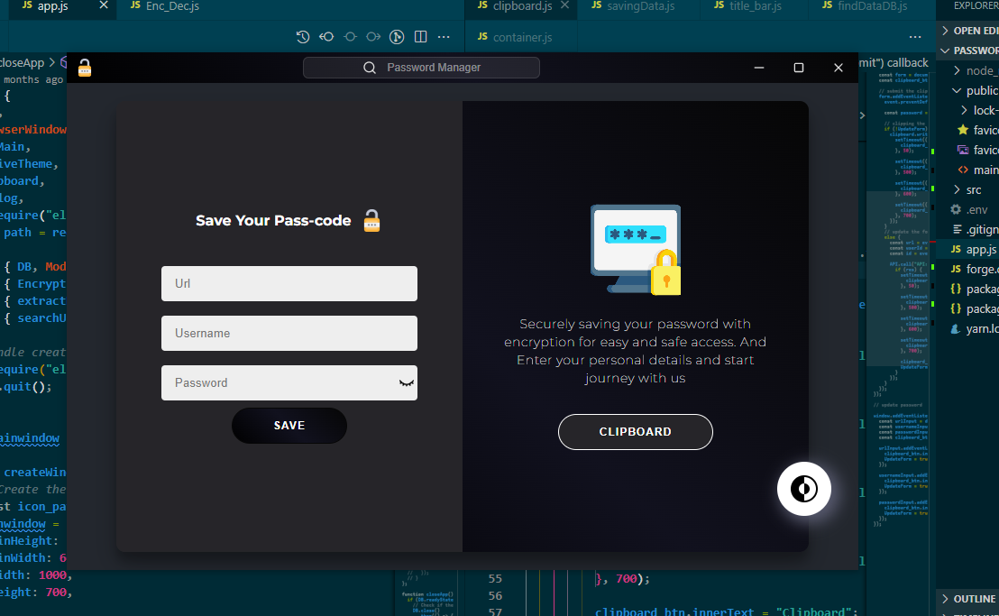
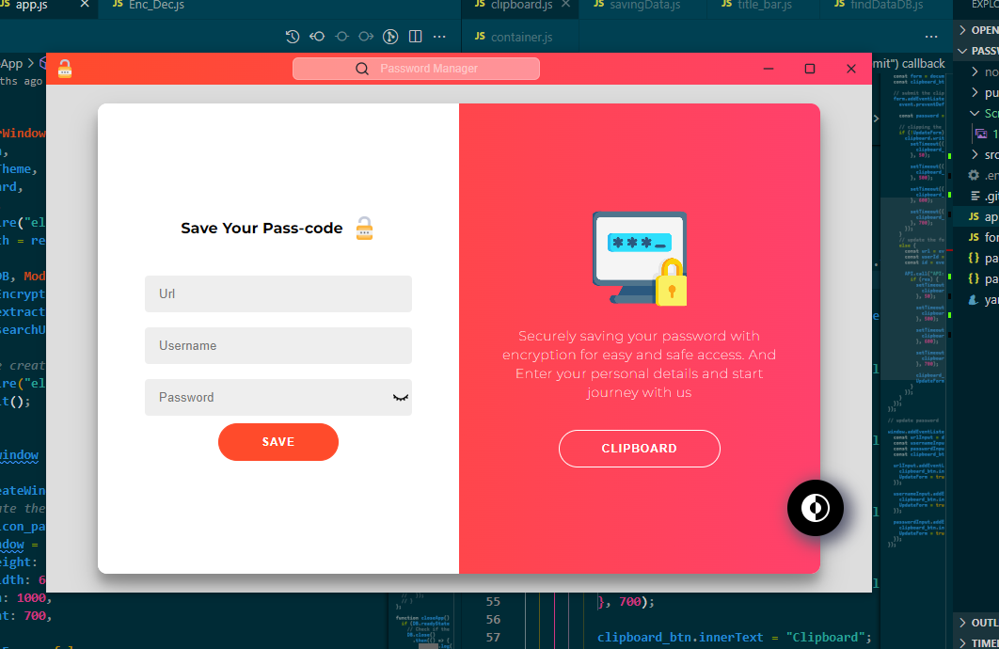

## 💪 [ElectronJs](https://www.electronjs.org/) Based Password Manager works with localhost MongoDB or Docker mongoDB.




## :seedling: Getting Started
#### Download [mongoDB](https://fastdl.mongodb.org/windows/mongodb-windows-x86_64-8.0.6-signed.msi) locally.
#### To run the code:
+ for Encryption
  + create `.env ` file in app directory
 
* Generate secure 256-bit key and Initialization Vector by running Below code
```js
const crypto = require('crypto');

const algorithm = 'aes-256-cbc';
const secretKey = crypto.randomBytes(32);  // Secure 256-bit key
const iv = crypto.randomBytes(16); // Initialization vector

console.log(`256-bit key is: ${secretKey}`);
console.log(`Init.. vector is: ${iv}`);
```
### place key secure key and init... vector inside `.env` file
```
SECRET_KEY=xxxxxx
IV=xxxxxx
```

### For running the application
> make sure mongoDB is running before running the application.
```
npm i
npm start
```


## :motorcycle: Other Repositories
- [Screenshot Application](https://github.com/manishTirkey69/Screenshot_electron)
  - ElectonJS and python based Screenshot Application.
  - window sticks on top of window application.
  - Take screenshots of the particular area.
- [QT based Screenshot Application](https://github.com/manishTirkey69/Screenshot)
- [Cpp-Web-compiler](https://github.com/manishTirkey69/Cpp-Web-Compiler)
- [Text2SQl MultiAgent for PostgreSQL](https://github.com/manishTirkey69/Text2SQL-MultiAgent)
